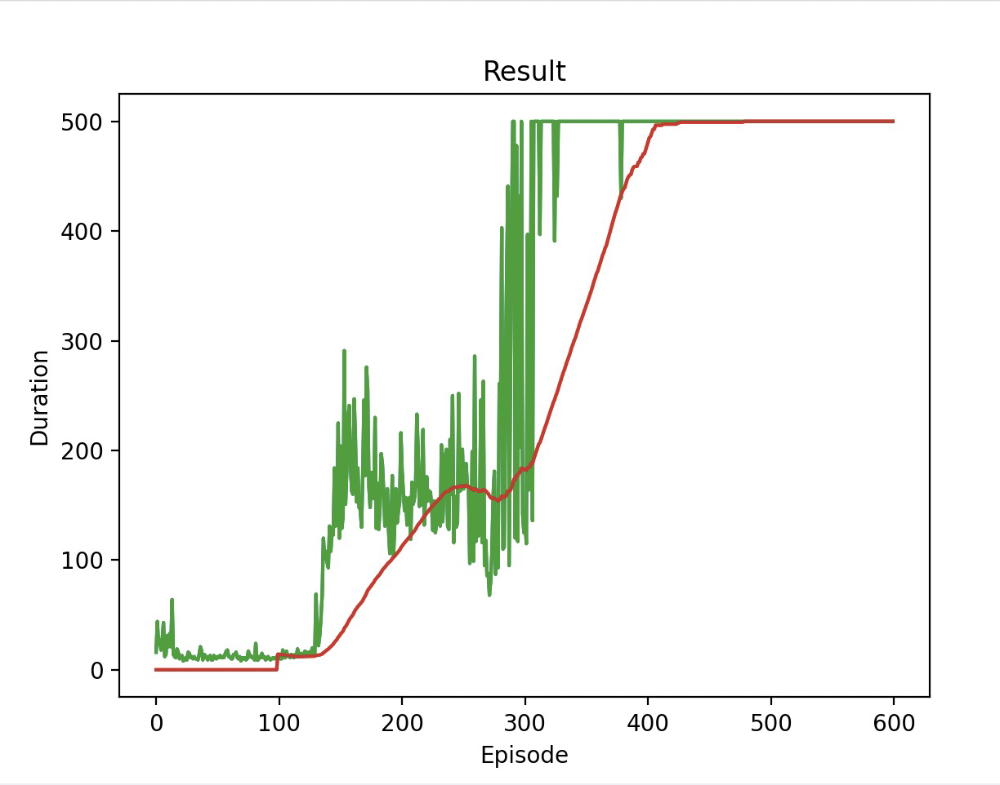
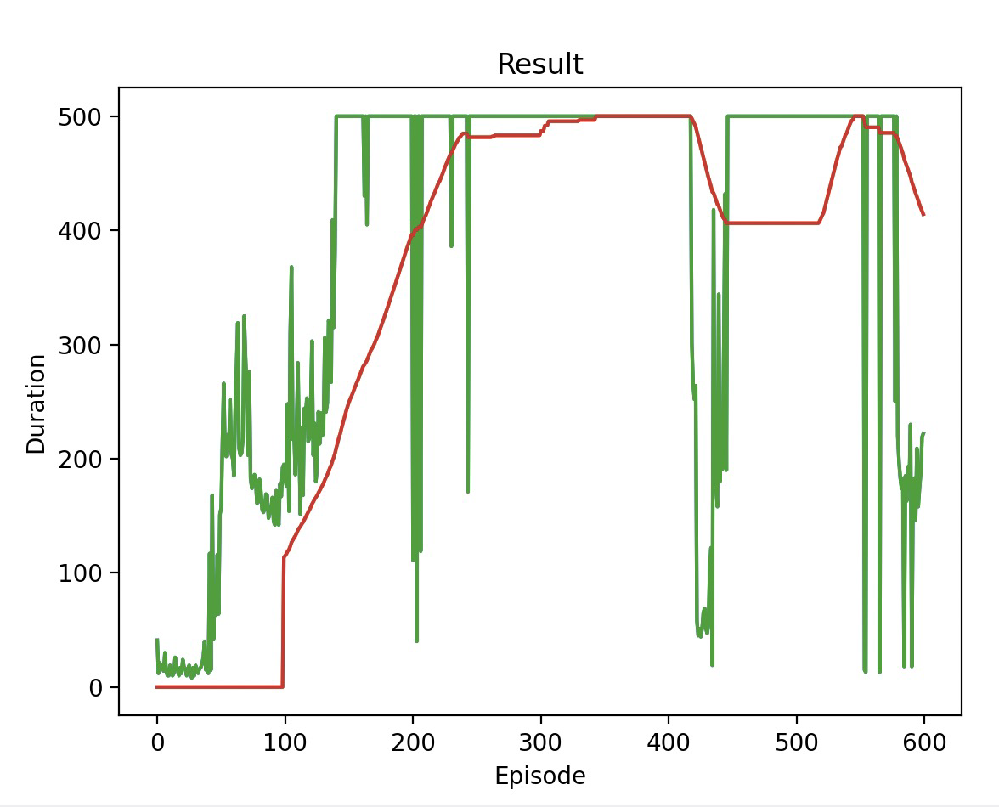
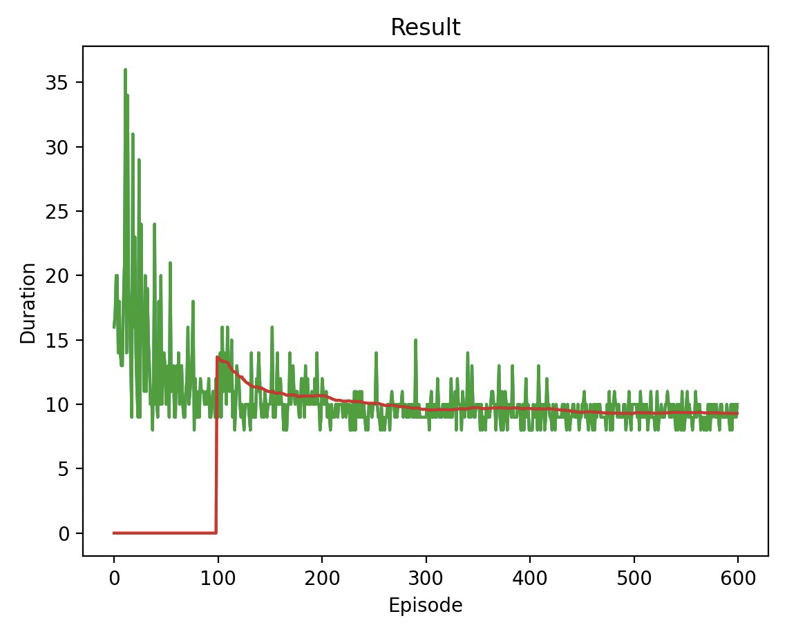
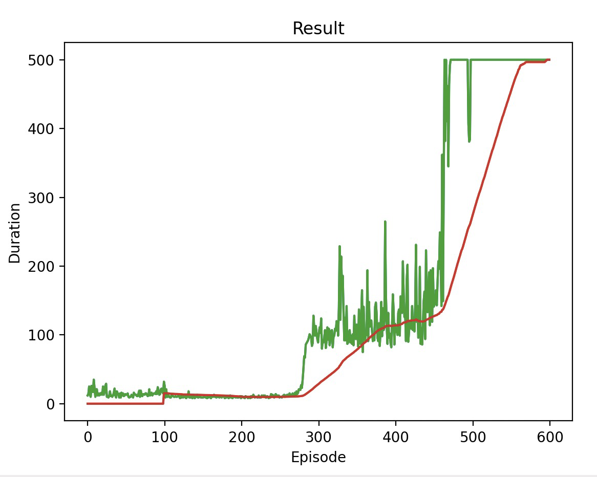
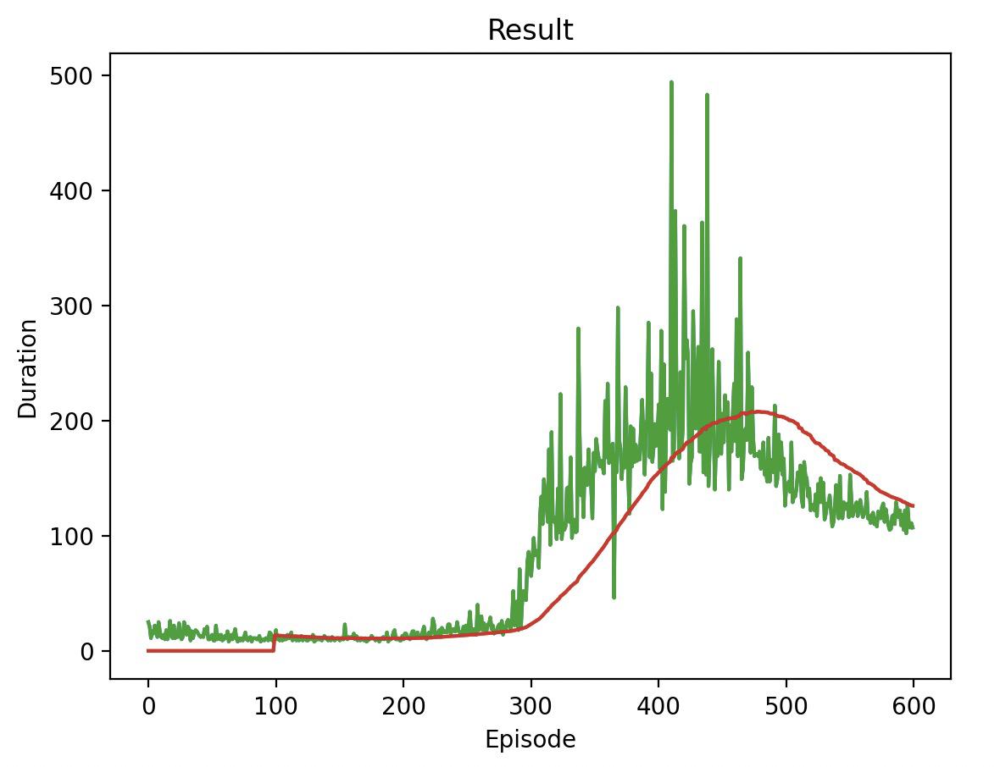
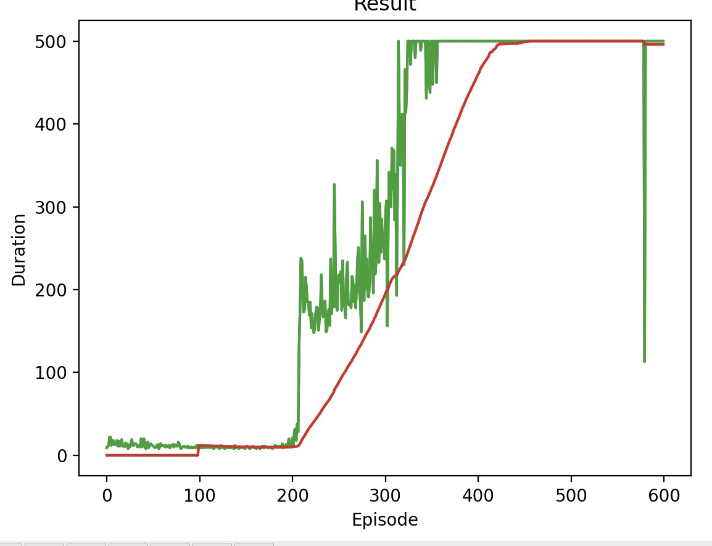
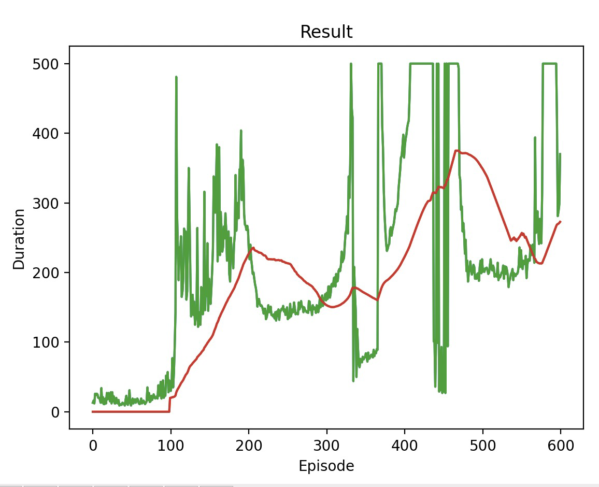

# Report

## Architecture of Neural Network

I used three linear layers in my feed forward neural network. I used linear layers because the input and output data are 1D vectors. I experimented with adding additional layers but found 3 to be the most optimal, which makes sense given the simplicity of the features.

## Final Hyperparameters Chosen

These hyperparameters that yielded the best results (mean duration increasing in a smooth manner then flatlining at the maximum duration of 500) were chosen based on the training plots. 

Batch size: 128

Gamma: 0.99

Epsilon start: 0.9

Epsilon end: 0.01

Epsilon decay: 1000

Tau: 0.005

Learning rate: 1e-4

Huber loss function

AdamW optimizer

## Training progression plots

Final Hyperparameters

Learning rate 1e-3

Learning rate 1e-5

Tau 0.01

Tau 0.001

Eps decay 500

Eps decay 1500

## Insights and difficulties

I found that tuning hyperparameters made a huge difference in the quality of the NN. 

In order to get a complete plot, I changed script to run 600 episodes using my CPU  (my machine couldn't use cuda). However, this resulted in the script taking a long time to finish (up to 5 min), which made tuning hyperparameters very tedious. 

Another challenge was finding the right methods to use. Even though the pseudocode was provided and I had a high level understanding of how it worked, actually implementing it with the provided libraries and methods was still difficult.

